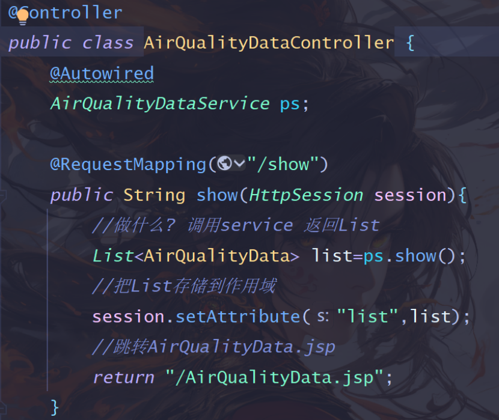
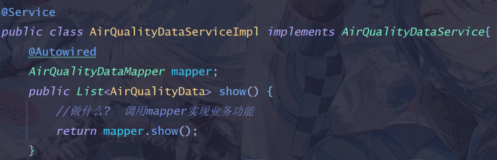
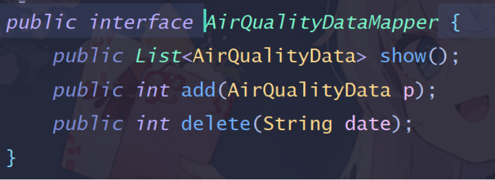
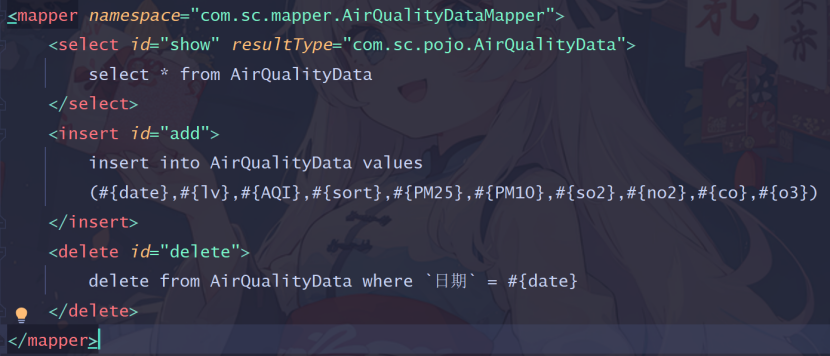
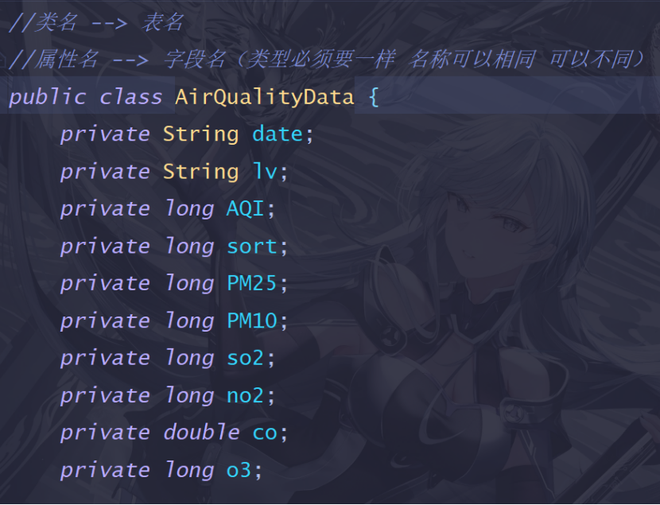

### SSM框架各层的作用
1. Controller层（也称为控制层）
> &emsp;&emsp;接收用户的请求、调用Service层的业务逻辑来处理这些请求、将结果传递给View层进行展示。
> 

>
> 

2. Service层（业务逻辑层）
> &emsp;&emsp;负责处理业务逻辑、调用Mapper层提供的接口来实现具体的业务功能、它处于Controller层和DAO层之间，起到了一个承上启下的作用。
> 

> 
> 

3. Mapper层(持久层)
> &emsp;&emsp;主要负责与数据库进行交互，它封装了与数据库相关的操作，如查询、插入、更新和删除等。Mapper通常包含接口和对应的XML配置文件，用于定义SQL语句和执行数据库操作。
> 

>
> 
> 

4. POJO层(实体层)
> &emsp;&emsp;主要存放实体类，这些实体类通常与数据库表结构相对应。POJO（Plain Old Java Object）是简单的Java对象，不包含业务逻辑，只用于存储数据。
> 

> 
> 
