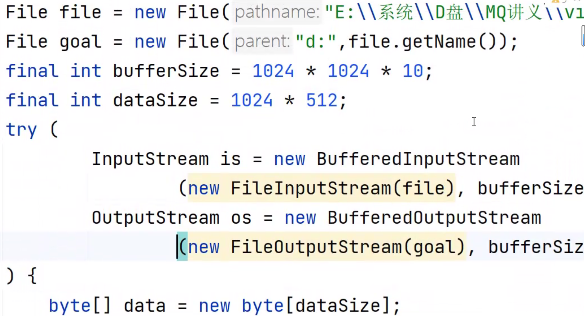

### 一、File对象的使用
> 1.创建File对象的四个构造方法
> > 
> >&emsp;&emsp;什么是两个反斜杠？ "\\" 字符转义为 "\" , 单个反斜杠是转义。 Windows系统的路径是两个反斜杠。
> > &emsp;&emsp;可以使用File类的separatorChar静态成员，会根据系统来判断是用哪个斜杆。
> 
> 2.File对象的API
> > 操作目录：
> > * `getName()` : 获取文件/目录名
> > * `exists()` : 判断文件/目录是否存在
> > * `mkdir()` : 创建一级目录
> > * `mkdirs()` : 创建多级目录 ,还没有创建的目录有多级的情况下用mkdirs()
> > * `idDirectory()` : 判断是否为目录 , 只能判断已经创建的目录, 未创建的目录直接返回false
> > * `list()` : 获取目录下的所有文件的文件名，返回一个String数组
> > * `listFiles()` : 获取目录下的所有文件的File对象，返回一个File对象数组
> >
> > 操作文件：
> > * `isFile()` : 判断是否为文件 , 不存在的文件直接判断为false.
> > * `createNewFile()` : 创建文件
> > * `delete()` : 删除文件/单级目录 （无法删除多级目录。)
> > * `deleteOnExit()` : 并不会立即删除文件或目录，而是在 JVM 正常关闭（无论是由于程序正常结束、异常退出还是系统关闭）时，才会尝试删除该文件或目录。
> > * `getFreeSpace()`  : 用于获取指定路径所在分区的未分配空间大小，单位为字节。
> >
> > 
> 
> 3.使用File对象创建文件/目录
> > 
> 
> 4.使用File对象打印目录结构
> > 实现原理：如果是文件就直接打印，如果是目录则要递归调用打印方法。
> > 
> 
> 5.使用File对象递归删除多级目录
> >&emsp;&emsp;在Java中，File类本身并没有直接提供一个方法来递归地删除一个目录及其所有子目录和文件。但是，你可以通过编写一个递归的方法来实现这个功能。
> > &emsp;&emsp;实现原理：和上面一样，如果是文件就直接删除，如果是目录则要递归调用删除方法。

### 二、 输入流
>> &emsp;&emsp;在ASCII编码下，英文字符占1个字节，中文字符不被支持。 
>> &emsp;&emsp;在UTF-8编码下，英文字符通常是1个字节，中文字符通常是3个字节。 
>> &emsp;&emsp;在GB2312和GBK编码下，英文字符占1个字节，中文字符占2个字节。 
> 
> 1.使用输入流的read()方法，按字节从文件中读出内容
>> read()方法一次读一个字节，返回读到的字节，中文(3个字节)会乱码。
>> 
> 
> 2.使用输入流的read(bytearray)方法，指定每次从文件中读出读bytearray数组大小个字节(遇到文件末尾停止并写入-1）到bytearray数组中。
>> read(bytearray)方法，返回的是读出的字节个数。 
>> 
>> 这个返回值可用在byte数组转String对象上，上面是直接将byte数组中所有内容转为String，可是byte数组中并非全是有效内容，
>> 所以使用返回值来指定从byte数组中读取多少个字节。
>>
> 
### 三、输出流
> 1.使用输出流的write()方法，将字节数组写入到指定文件中
>>  文件输出流FileOutputStream的构造器的第二个参数表示是否追加写入，默认为false，不追加覆盖写入。
>>  
> 
> 2.如何指定String的编码方式？ 
> > 在getBytes()里指定编码方式，默认使用Java平台的默认字符集。
> > String类的getBytes()方法用于将字符串转换为字节序列。如果不指定编码方式，getBytes()方法默认使用Java平台的默认字符集（也称为默认字符编码），这通常是UTF-8。
> 
> 3.把C盘的一个图片文件写入到D盘

### 四、字符流
> > * 输入输出流中最大的类是 InputStream 和OutputStream 它们是字节流
> > * 字符流是 Reader 和 Writer。
> > * 一个中文字符是3个字节，但其可以用Unicode码表示，一个Unicode码只占2个字节。char保存的就是Unicode码。
> > * 在Java中，字符流默认使用Unicode编码，特别是UTF-16编码（对于char类型）。
> 
> 使用字符流读写文件
> > * Reader对象的read()方法 ： 从文件中按字符读写文件。读出来的是UniCode码，读到末尾则返回-1 。
> > * Writer对象的write()方法 ： 以字符的形式向文件中写入数据。
> > 

### 五、缓冲区
> 0.缓冲区的作用：
> >
> > 减少的磁盘读写次数。
> 
> 1.缓冲区流：
> > 用法：在创建字节流或字符流对象时在外面套一层缓冲区流。
> > * BufferedInputStream : 
> > * BufferedOutputStream :
> > * BufferedReader : 
> > * BufferedWriter : 
> >
> >  
> 
> 练习 ： 把C盘的一个文件夹写入到D盘。
