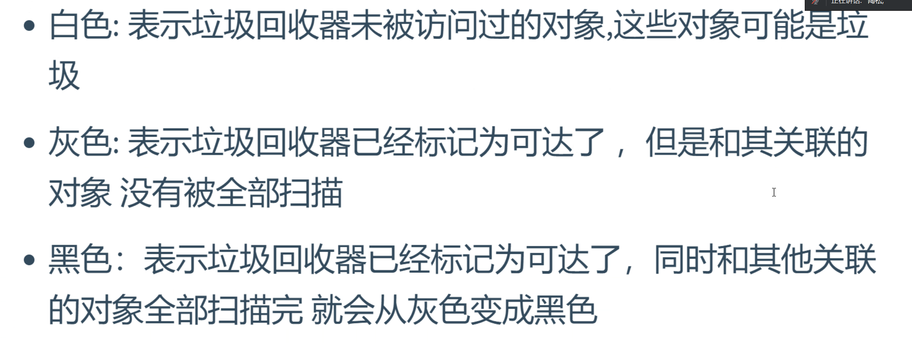

### 1. GC是什么 & 不可达对象？

### 2. GC的算法(重点)

### 3. GC标记算法(重点)
####3.1 引用计数法

* 缺点：无法处理循环引用问题，如果多个对象之间相互引用，计数器永远不为0，除非有外力介入，不然永远不会回收，会造成内存泄漏。

####3.2 可达性分析法

####3.3 三色标记法

* 三色标记法的执行原理
  
  
### 4. GC回收算法(重点)
#### 4.1 标记清除法

* 缺点：会导致内存碎片化
#### 4.2 复制(拷贝)算法

* 缺点：
#### 4.3 标记压缩法（标记整理法）

* 缺点：

#### 4.4 分代算法

##### 4.4.1 From区和To区之间的转换

##### 4.4.2 新生代和老年代之间的转换

### 5. 面试题
> 1. 什么是GC？
> 2. GC有哪些算法？
> 3. GC算法有哪些标记算法？ -- 优缺点
> 4. 新时代和老年代是什么？如何转换的？
> 5. 新时代和老年代适合什么算法，为什么？

