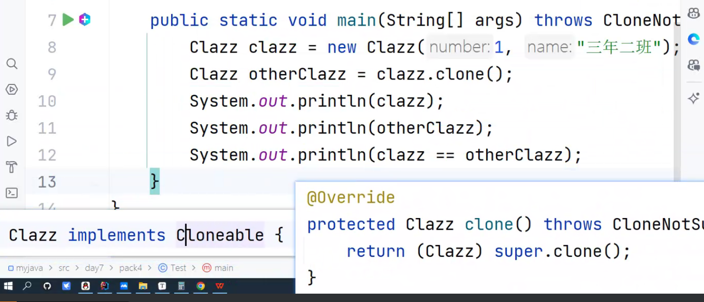
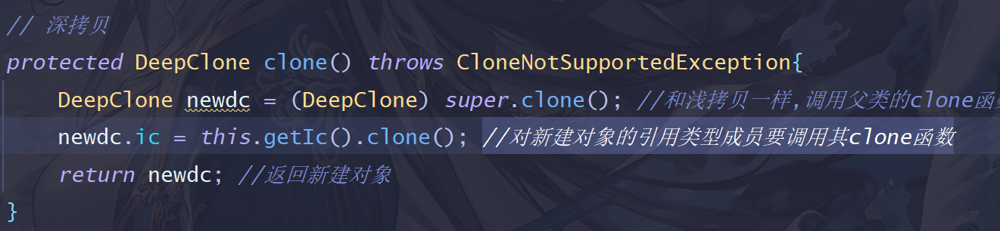

###day8

####6.拷贝
> 0.概念 
> > * 深拷贝：会拷贝引用类型成员变量指向的对象的内容。
> > * 浅拷贝：只拷贝引用类型成员变量的引用，会导致新对象和老对象的引用类型成员变量指向同一空间。
>
> 1.浅拷贝 
>
> >a.在子类中重写Object的clone方法（记得抛异常） 
> >b.让类实现Cloneable接口（授权） 
> >c.在调用clone方法的地方也要抛异常。
> >
>
> 2.深拷贝 
> >拷贝时，新对象的引用类型成员要调用其显式调用其重写后的clone函数，其他和浅拷贝没区别。
> >
>
