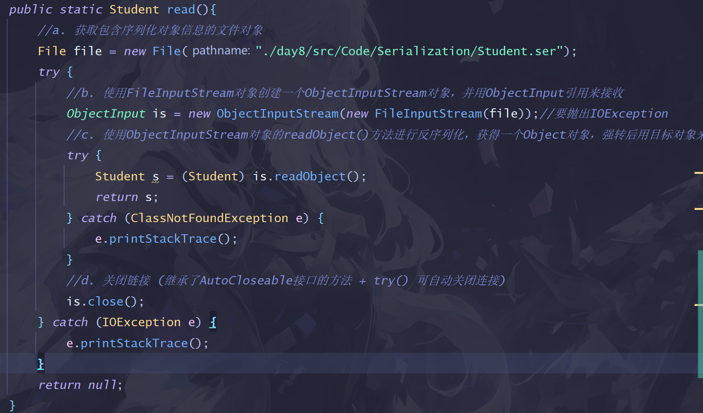

###day8

####7. 序列化和反序列化
> a.概念
> >&emsp;&emsp;`序列化`是将`对象`转换为`字节序列`的过程，以便可以将对象写入文件、传输到网络上的另一个位置或存储在内存中的数据库等。`反序列化`则是将字节序列恢复为Java对象的过程。
> 
> b. 序列化 
> >1. 要序列化的对象要实现`Serializable接口`(标记接口) `implements Serializable` 
> >2. 创建`File对象`确定保存序列化后对象的文件. 
> >3. 使用`FileOutputStream对象`创建`ObjectOutputStream对象` (要处理`IOException异常`)
 (ObjectOutput \ ObjectOutputStream \ FileOutputStream)
> >4. 使用创建好的`ObjectOutputStream对象的writeObject方法`来序列化目标对象,并将其写入到目标文件中.
      `os.writeObject(student);` 
> >5. 关闭文件链接 
> > `os.close();`
> >
> >
> >
> >如果了解try + AutoCloseable接口 实现自动关闭,还可以写一个简化版:
> >
> 
> c.反序列化 
> >1. 获取包含序列化对象信息的`文件对象`。 
> >2. 使用`FileInputStream对象`创建一个`ObjectInputStream对象`，并用`ObjectInput引用`来接收（ObjectInput / ObjectInputStream / FileInputStream)【使用输入输出流对象要抛出IOExceptiony异常】 
> >3. 使用`ObjectInputStream对象`的`readObject()方法`来反序列化：`该方法返回一个Object对象`，强转后用目标对象的引用来接收，从而完成反序列化。
> >4. 使用`close()方法`关闭所有输入输出流的链接
> >
> >
> >
> >简化版：AutoCloseable接口 + try()可自动关闭链接
> >