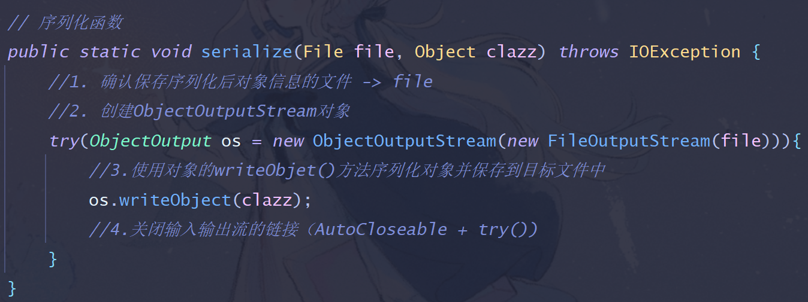
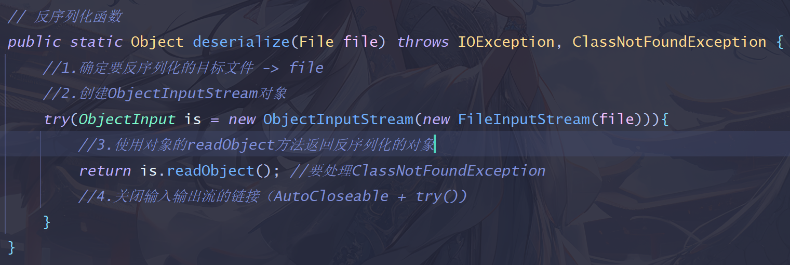

## 如何写序列化和反序列化函数

### 1. 序列化函数

> a. 设置File类型参数和Object类型参数 
>
> b. 创建ObjectOutputStream对象 
>
> c. 调用对象的writeObject()方法，序列化Object形参。 
>
> d. 关闭流对象链接（AutoCloseable + try() = 自动关闭） 
>
> 

### 2. 反序列化

> a. 设置File类型参数，返回值为Object类型 
>
> b. 创建ObjectInputStream对象 
>
> c. 调用对象的readObject()方法获得一个Object对象 
>
> d. 关闭流对象链接（AutoCloseable + try() = 自动关闭） 
>
> 