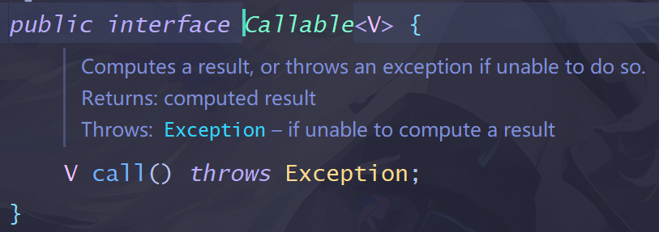

## 多线程

### 1. 进程是什么？
> * 代表一个正在执行的程序，是程序所持有的所有资源和线程的集合。
> * 一般情况下一个程序只有一个进程，每个进程也会有自己独立的空间，所以不同程序运行期间可以互不影响。

### 2. 线程是什么？
> 线程是进程的一部分，它是程序执行过程中的某个任务。

### 3. 进程和线程的关系
> 进程是程序所拥有的资源和线程的集合，线程是进程的一部分。

### 4.多线程并发
> 表示多个线程交替抢占CPU资源，并不是同时执行，由于切换CPU的时间非常短，正常无法发现是在交替执行，所以用户看起来是同时在执行。
>  CPUn核是什么意思？--代表CPU有n个独立的运算核心，即真正有能力在同一时间点执行n个线程。

### 5.Java分类
> a. 守护线程
> > * 守护线程是一种特殊的线程，它在后台运行，用于服务用户线程。当所有的用户线程结束了，JVM会退出，守护线程会强制结束。
> > * 是为了给用户程序提供帮助而存在的。是用户线程的保姆，比如：GC垃圾回收机制就是守护线程。
> > 
> > > 守护线程通常用于“服务”用户线程，这一说法源于守护线程的设计初衷和运行方式。 这里的“服务”指的是守护线程提供某种辅助功能或资源管理服务，从而让用户线程可以更专注于其核心任务。以下是守护线程如何服务用户线程的一些具体方式：
> > > * 资源管理：守护线程可以负责监控和管理系统资源，例如内存、文件句柄或网络连接。当用户线程使用这些资源时，守护线程可以确保资源的合理分配、回收和再利用，防止资源泄漏。
> > > * 后台清理：在程序运行过程中，可能会产生一些临时文件、日志或其他需要定期清理的数据。守护线程可以在后台运行，定期检查并清理这些不再需要的文件或数据，以保持系统的整洁和高效。
> > > * 定时任务：守护线程可以执行定时任务，如定期更新缓存、发送心跳包、检查系统状态等。这些任务通常不是用户线程的主要关注点，但由守护线程在后台默默执行，可以确保系统的稳定性和可靠性。
> > > * 性能监控和日志记录：守护线程可以监控系统性能，如CPU使用率、内存占用等，并生成相应的日志记录。这些信息对于后续的性能分析和问题排查非常有价值。
> > > * 异常处理和恢复：在某些情况下，用户线程可能会遇到异常情况，如网络连接中断、文件读写错误等。守护线程可以监听这些异常，并尝试进行恢复操作，如重新建立连接、修复文件等，以确保用户线程能够继续正常工作。
> > > * 提供公共服务：守护线程还可以提供一些公共服务，如线程池管理、消息队列处理等，这些服务可以被多个用户线程共享和使用，从而提高系统的整体效率和性能。
> > >7
> > > 总的来说，守护线程通过提供资源管理、后台清理、定时任务、性能监控、异常处理和公共服务等功能，为用户线程创造了一个更加稳定、高效和可靠的运行环境。这样，用户线程可以更加专注于实现其核心业务逻辑，而无需过多关注底层细节和辅助任务。
>
> > 实现方式：.setDaemon()  [daemon-守护神，精灵]
>
> b. 用户线程
> > 程序员自定义编程的线程。
>
> > 创建线程的方式（面试题）：
> > * 继承Thread类，重写run()方法
> > * 实现Runnable接口(表示编写方法的一种规范），实现run()
> > * 实现Callable接口，实现call() (Callable继承于Runnable) + FutureTask<> ( .get()获取返回值 )
> > * 利用线程池 
> >   - 可缓存线程池
> >   - 可定长线程池
> >   - 可周期定长线程池
> >   - 单线程线程池
> >   - 自定义线程池
>
> > 细节1： 
> > `Runnable接口的run()方法中不能通过抛出异常来解决异常`，因为实现的接口中没有抛异常，重写时，子类的异常不能多于父类。
>
> > 细节2： 
> > 守护线程不能在线程启动start()后设置会报错。
>
> > 细节3： 
> > Callable接口使用了泛型，可以用来指定call方法的返回值的类型。
> > 不设置则默认为Object类型。
> > 

### 6. Runnable接口 和 Callable接口的区别
> * Callable 实现的方法是call(), Runnable实现的是run()
> * call() 可以返回值，run()没有返回值
> * call() 可以抛异常 run()只能捕获异常不能抛出
> * Callable需要依赖FutureTask对象封装才可以使用，FutureTask的底层就是Runnable接口类型。

### 7. 线程的常用方法
> * currentThread() ：Thread类静态方法，表示正在执行的线程对象
> * setName()：设置线程名，默认值会失效　
> * getName() :　获取线程名称，如果没有设置名称，名称默认为 "Main(主函数独有)" 或 "Thread-N"
> * sleep(毫秒)：Thread类静态方法，让线程进入休眠(阻塞状态)放弃当前cpu执行权，休眠过后继续和其他线程竞争cpu（就绪状态）
> * start() : 表示启动一个线程 可以和其他线程竞争CPU(就绪状态)
> * run() ： 只是线程执行逻辑 启动线程不是用run()
> * t.join() : 等待t线程执行结束后，再执行当前线程，如果t线程一直不结束， 当前线程会一直等待(阻塞状态)
> * yield() : Thread类静态方法，放弃当前cpu执行权，进入就绪状态（下一次还可能会抢cpu 是为了提供一种可能）
> * setPriority() : 设置线程优先级1-10 值越高优先级越高，10最高，默认为5
>                    Thred提供三个常量分别表示 最低(MIN_PRIORITY) 最高(MAX_PRIORITY)  默认优先级
>
> ---- 属于线程常用的方法 但不属于线程的方法（属于Object) ----
>
> * wait() ：让线程进入等待状态（阻塞状态），需要其他线程来唤醒他，否则不会再执行，进入等待会放弃对象锁
> * notify() ： 唤醒随机一个处于等待的线程(不公平)
> * notifyAll() ： 唤醒所有处于等待的线程

### 6. 线程状态（面试题）
> 线程的状态有哪些？ == 线程的生命周期是什么？ 
> 什么是生命周期？--出生到死亡的过程 
> * a. 新建状态: 当new Thread创建了新线程，就处于新建状态。
>
> * b. 就绪状态：处于新建状态的线程，调用start()就会进入就绪状态，或sleep()睡醒后的也会进入就绪状态， 进入就绪状态就会参与CPU的竞争
>
> * c. 运行状态：当线程抢到了CPU后，自动运行run()方法，这时处于运行状态。
>
> * d. 阻塞状态：线程在运行时，由于各种原因可能会导致线程暂时停止执行。 
>      阻塞原因： 
>    - 1.wait需要别人唤醒我。 
>    - 2.sleep不睡醒不会执行 
>    - 3.join 需要等待线程执行结束
>    - 4.ft.get() 需要等待call()执行结束后才继续执行
>    - 5.Scanner等待用户输入
>    
> * e. 死亡状态：正常死亡、非正常死亡。线程运行过程中可能受外部干扰可能中断线程。
>
>       - 1.正常死亡：run()正常结束。
>       
>       - 2.非正常死亡：run() 运行时出现异常没有捕获，导致程序中断