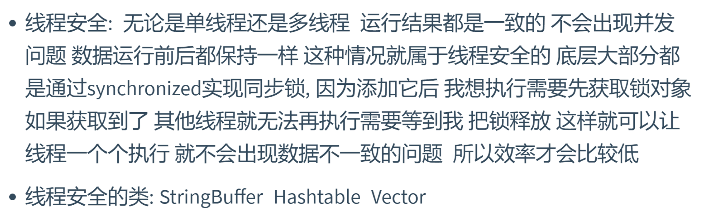
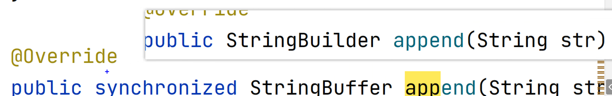
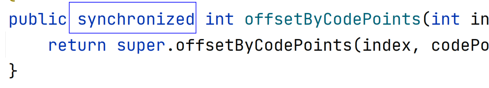
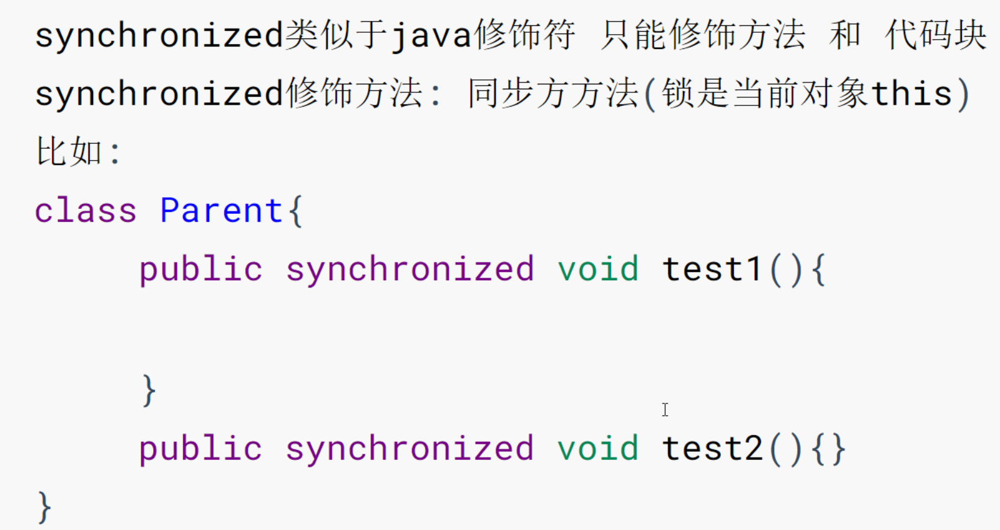
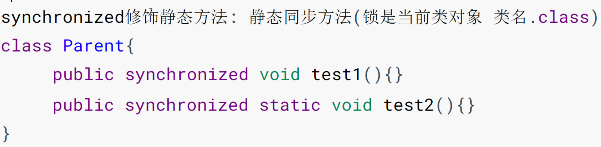
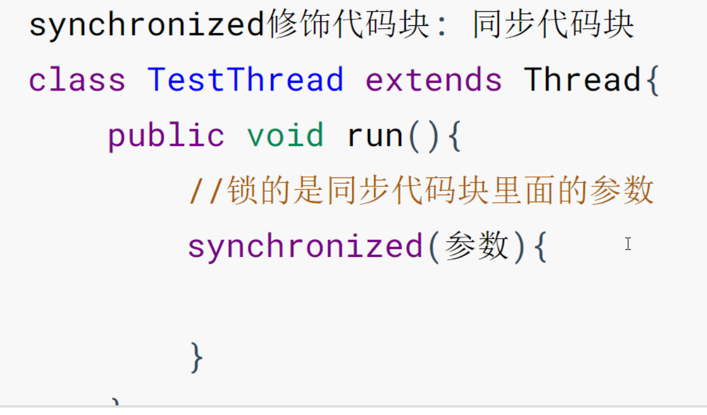
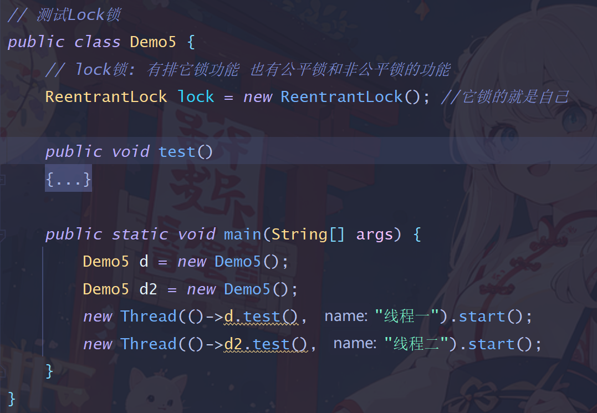
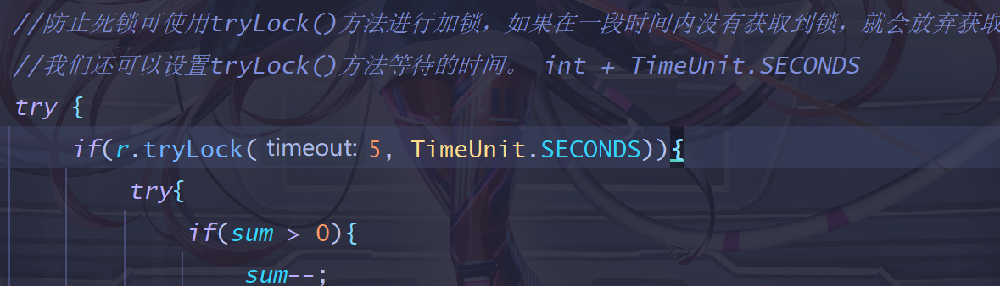

## 一、线程同步
### 1. 什么是线程安全？
> * 线程安全：无论是单线程还是多线程，`运行结果都是一致的`，不会出现并发问题。

### 2. 有哪些线程安全的类？
>  
> * StringBuffer(StringBuilder)
> * Vector(已过时，不考虑)
> * Hashtable(Hashmap是不安全的)
> > 怎么做到的线程安全的？
> > 
> > 
> > 大部分通过synchronized关键字来实现，synchronized关键字实现了同步锁，同一时间内只能有一个对象访问锁对象，其他对象只能等待我把锁释放掉，这样就可以让线程一个一个执行，就不会出现数据不一致的情况，但这也导致了效率更低。

### 3. Java实现线程安全的方式
> * b. 使用synchronized关键字
> * a. 添加线程的同步锁

## 二、Synchronized关键字的使用
> synchronized关键字用于方法或代码块，使其变为 `同步方法` 、`同步代码块`。
1. 同步方法
> &emsp;&emsp;如果一个对象中有多个同步方法，这些方法之间会相互影响，因为它们共享同一把锁——即对象实例本身（this）。 
> &emsp;&emsp;当一个线程进入一个同步方法时，它会获取该方法所在对象的锁。如果此时另一个线程尝试进入该对象的另一个同步方法，它将会被阻塞，直到第一个线程退出其同步方法并释放锁。
2. 同步代码块
> &emsp;&emsp;synchronized还可以用于特定的代码块，以提供更细粒度的锁定。这种情况下，需要明确指定锁对象。 
> &emsp;&emsp;如果不同的代码块使用了同一个锁对象，那么这些代码块之间会互相影响。 
> &emsp;&emsp;假设我们有一个公共的锁对象lock，和两个使用此锁对象的同步代码块A和B。
如果有一个线程进入了代码块A并获取了lock，那么任何尝试进入代码块A或B的其他线程都将被阻塞，直到前面的线程退出代码块A并释放lock。
3. synchronized关键字的作用
> * 原子性：确保同一时间只有一个线程可以执行同步代码块或方法，从而保证操作的原子性。
> * 可见性：当一个线程修改了共享变量的值，新值对其他线程立即变得可见。这是因为synchronized关键字会确保内存可见性。
> * 有序性：synchronized关键字会禁止指令重排，从而确保代码的执行顺序与编写顺序一致。

## 三、线程同步锁（难点）
### 1. 排它锁/独占锁
> 
> 
> a. synchronized关键字
> > * sychronized关键字的语法规则：
> > 
> > 
> > 
> > * sychronized关键字锁的是什么？ 
> > 非静态方法：锁的是this，同一个对象调用带锁方法时：首先要申请锁。
> 
> b. Lock锁
> > 
> > * 小细节1：释放锁时，为了防止异常发生导致锁没有释放，会把释放锁放到finally里面
> > * 小细节2：lock是对象中的成员变量，不同对象所持有的lock不同：
> > 
> > * 小细节3：防止死锁可使用tryLock()方法进行加锁，如果在一段时间内没有获取到锁，就会放弃获取。
> >  我们还可以设置tryLock(时长, 单位)方法等待的时间。 int + TimeUnit.SECONDS
> > 
 
### 2. 读写锁
>  
> 读写互斥代表读的过程中不能写，写的过程中不能读。

### 3. 公平锁 和 非公平锁
### 4. 乐观锁 和 悲观锁
### 5. 死锁