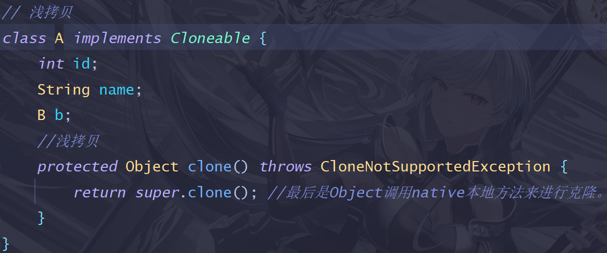
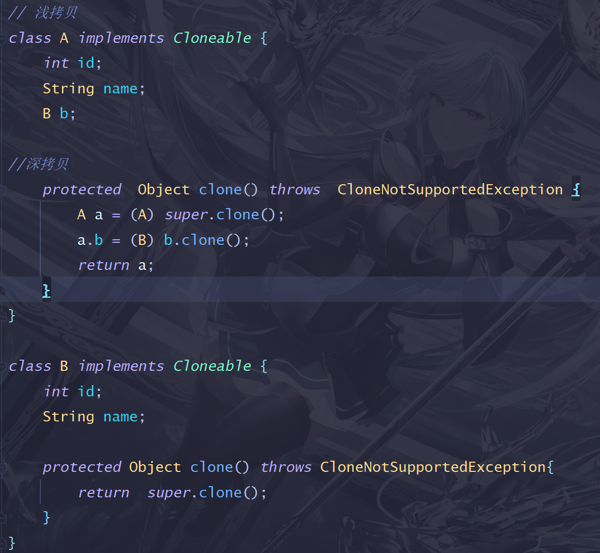

## 深浅拷贝

1. 深浅拷贝的区别

2. Java中实现浅拷贝
> 只要重写clone()方法，在里面调用父类的clone()就可以了。
> 

3. Java中如何实现深克隆？
> 让对象的引用类型成员也继承Cloneable接口，并重写clone()方法。
> 并且对象和对象的成员都要调用clone()方法。
> 
 
> 小细节：
> * 更改引用类型成员的指向，无论是深拷贝还是浅拷贝，拷贝对象中对应的引用成员不会跟着改变。
> * 为什么要调用父类的clone?  因为最终要调用Object的clone，由它调用本地方法来完成克隆操作。
> * 为什么clone不走构造函数?  clone最终是由本地方法来完成的，它直接在内存中开辟了一块区域，将要拷贝的内容放到其中，所以克隆不走构造函数。