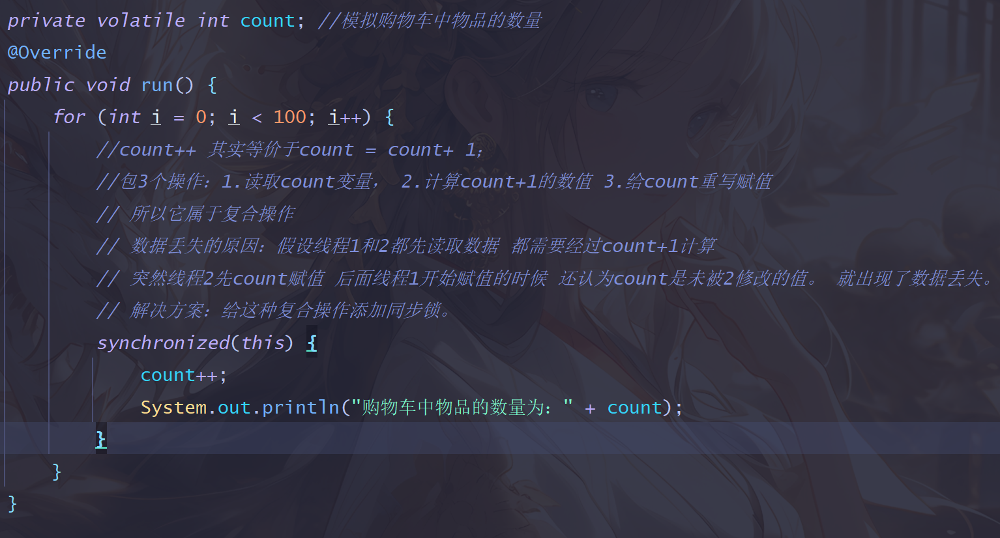
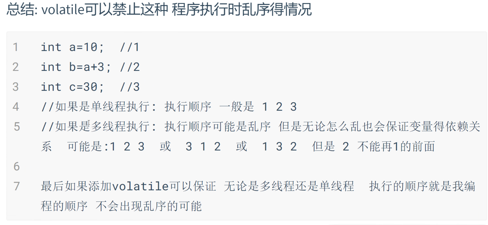

## 公平锁和非公平锁
> 
> 读写锁 也是通过构造函数创建公平锁和非公平锁。在构造函数中加 true 或 false;

## 乐观锁和悲观锁 -- 面试题
> 
> 实现乐观锁：
> 乐观锁和悲观锁的区别：
> * 悲观锁是互斥的，一旦上锁，其他线程无法访问临界资源，必须等待，前面的线程释放锁。
> * 乐观锁不是互斥的，任何线程都可以访问临界资源，但是会通过一个具有原子性的版本号或时间戳来确定两次查询的结果是否被别的线程修改，
> 如果查询前后两个版本号一致表示没有被修改，即可提交事务，版本号+1,否则事务回滚。

## 死锁
0.死锁是什么？
> &emsp;&emsp;死锁就是在同一时间点，存在两个或多个线程(进程)，它们身上有其他线程(进程)所需要的资源，导致需求链形成了一个环，而且它们还都无法释放自己拥有的资源，这就导致了死锁。

1.死锁的四个必要条件（面试题）
> * 互斥条件（Mutual Exclusion）：至少有一个资源必须处于非共享模式，即一次只有一个线程（或进程）能够使用。如果其他线程请求该资源，请求者将等待，直到资源被释放。
> * 持有且等待条件（Hold and Wait）：一个线程（或进程）至少持有一个资源，并且正在等待获取其他线程持有的额外资源。
> * 非抢占条件（No Preemption）：资源不能被强制从一个线程（或进程）中夺走，线程必须主动释放资源。
> * 等待循环条件（Circular Wait）：存在一个等待循环，其中每个线程都在等待下一个线程所持有的资源。
> 
> 
> 
> 
> 当这四个条件同时成立时，必然会发生死锁。

2.如何避免死锁（面试题）
> 
> 
> 对第四条的补充：如果按照升序编号，则不能降序申请：

## volatile关键字 (面试题)
> 1.volatile不能保证原子性（线程安全)
> > 原子性：要么都做，要么不做。
> > 
> 
> 
> 

> 2.volatile可以防止指令重排序 (为什么需要volatile)
> 重排序：为了充分利用cpu,CPU会对编写的指令或 编译器对指令 进行重排序， 为了让CPU可以永不停息的工作，所以导致了最后指令运行时的顺序不是我们在代码中编写的顺序。 
> 
> `volatile只能修饰变量 `
 
> 3.volatile可以保证数据的可见性
> * 主内存：线程访问共享变量的位置
> * 线程工作内存：每个线程运行都要一个自己独立的空间。用于执行自己线程的内容。
> * Demo8的原因在于： 当变量money没有被volatile 修饰的时候
my1先开始 先把主内存money变量 读取到自己工作内存中
my2睡眠1秒后 去修改money变量的值 先在自己的工作内存中去修改 再去修改主内存的值
money 修改为50000后 my1线程由于不知道对方工作内存的结果 认为money一直是100000
当变量money被volatile修饰的时候，
my2修改完后 主内存的值也会刷新.
my2的工作内存money会失效 强制刷新主内存的值
my2修改了 my1就可见了.

> 4.volatile的三个特性(面试题)
> * 可见性:每个线程都有自己的工作内存,只要被volatitle修饰的变量被人改变其他线程工作内存的值就会失效,会强制刷新主内存的值 
>   类似于static(保证对象共享) volatile(保证线程中的共享)
> * 有序性:程序为了提高优化性能,在多线程情况下可能会出现乱序执行的情况,volatile可以保证无论是单线程还是多线程都不会出现乱序执行的情况
> * 无法保证原子性:volatitle不能修饰方法和代码块,它不能保证线程安全,它可以修饰属性 
>   无法保证属性在复合操作(i++)下的原子性.
