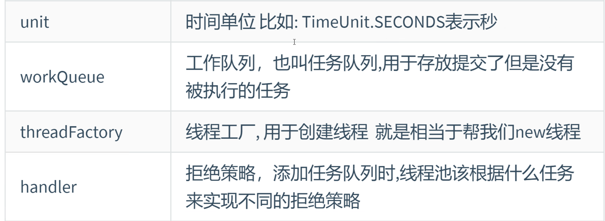

### 线程池
1.什么是池
> 一些常见的池:线程池、连接池、锁池、常量池

2.池的特点
> 
> 以空间换时间。

3.线程池的分类
> * 单线程池
> > 这线程池只会创建一个线程 确保所有任务都在一个单独的线程中顺序执行，丧失了并发性，但避免了并发问题。
> * 可定长线程池
> > 定义一个长度固定的线程池，所以说最高并发数量是固定的，如果超过了并发的数量，则会进行等待，等到其他线程使用完再进入
> * 可缓存线程池
> > 空间可以无限大，当并发量较高时，为了满足需求会创建线程；当并发量较低时，为了节省空间也会回收长时间不使用的线程。
> * 可周期定长线程池
> > 也具备上面定长线程池的功能（长度固定），但还支持周期操作(每个时间段都可以执行）和延迟操作（首次延迟的时间）
> * 自定义线程池
> > 如果有上面四种自带线程池满足不了的需求时，可以通过ThreadPoolExecutor来创建线程池来传入七大核心参数来满足定制需求。

4.线程池的创建
> * 创建线程池：
> 
> * 执行线程池：传入Runnable类型 或 Lambda
> 
> * 关闭执行：
> 
> 小细节：线程池关闭不影响线程池中已经开始执行的线程，但是不能再调用线程池来执行新任务了。

5.自定义线程池
> 
> a.ThreadPoolExecutor构造方法的参数（线程池的七大核心参数） 
> 源代码约1307行
> 
> 
> 
> b.常见的工作队列有哪些？ 
> 就两种，一种由数组实现，一种有链表实现，但都是阻塞队列，有任务就执行，没有任务就等任务来
> 
> c.拒绝策略 
> 取消的是任务队列中的任务
> 
> d.线程过程 
> 

6.实现自定义线程池
> 
