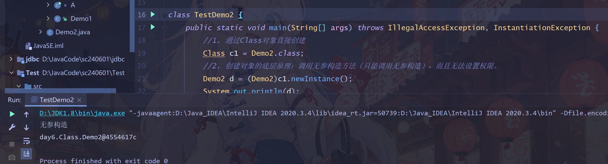
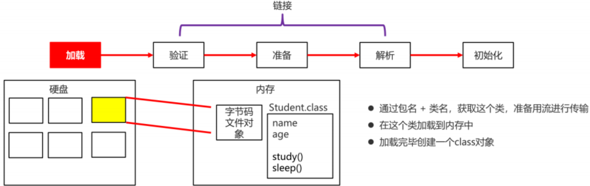

## 反射

### 一、什么是反射


### 二、反射的使用步骤

1. 先获取Class对象

   > 获取Class对象的三种方式：（面试题）
   >
   > 

   > 最优的是第三种方式：
   >
   > * 第一种通过类名访问，在不同包可能会重名，导致BUG
   > * 第二种要通过对象访问，必须先创建对象，没有对象就无法使用
   > * 只有第三种能保证在任何情况下准确访问到需要的类

2. 通过类对象.getXXX() 或取类中的任意资源（包括私有的）

   > 

### 三、Java反射存在几种特殊类

> * Class类： 描述类中的信息，它是类对象，也是反射的前提
> * Method类：描述类中的方法，类中有几个方法（包括继承的方法）就有几个Method类。只能描述普通方法
> * Constructor类：描述类中的构造方法，类中有几个构造方法，就会有几个Constructor类
> * Field类：描述类中的属性，类中有几个属性（包括继承的属性）就会有几个Field类
> * ……
>
> 
>
>
> ```java
> //总结：
> //1.带后缀s : 获取一个数组，数组中是要获取的资源
> //2.不带后缀s : 获取指定资源，要传入资源名称来指定
> //3.带中缀Declared :  获取本类的所有资源，可以获取私有资源（但不获取父类的资源）
> //4.不带中缀Declared : 只能获取本类和父类中的公有资源（只能获取公有资源）
> //5.私有成员，必须先开启权限才能访问
> //f1.setAccessible(true); //开启私有访问
> ```

### 五、Java反射的应用
> * 获取类中的资源 （看上面）
> * 设置和获取属性 （看上面）
> * 调用方法
> * 创建对象
> * 通过反射实现通用方法的调用。

### 六、调用方法
> 通过反射来修改属性，没有走类中的修改器，不然通过反射来修改私有成员的值，就不需要开权限了

### 七、创建对象
> 1. 利用Class对象直接创建：
> * 缺点：只能调用无参构造方法，而且无法设置权限
> 
> 将构造方法的权限设置为public后才可以使用：
> 
> 2. 利用构造方法对象创建：
> 无论哪种方法，反射的底层都会走构造器。
> * 注意反射的包一定包含了reflect

### 八、类加载的时机
> * 创建类的实例（对象）
> * 调用类的类方法（静态方法）
> * 访问类的类变量或者给类变量赋值（静态变量）
> * 使用反射强制性创建某个类的Class对象
> * 初始化某个类的子类
> * 使用java.exe命令运行某个主类
> *……

### 九、类加载器规则
> * 类加载器的主要作用：就是加载java类的字节码（.class文件）加载到JVM中（在内存中生成一个该类的Class对象）
> * JVM启动时，类加载器不会一次性加载所有类，而是根据需要去动态加载（延迟加载：什么时候使用什么时候加载）
> * 这就说明：大部分java的类只有用到才会去加载，目的是对内存更友好

### 十、类加载器分类
> * BootstrapClassLoader: 启动类加载器 
> > 最顶层类加载器，是由C++实现，通常表示为null，并且没有父级，主要是用来加载JDK内部的核心类库，比如：java.lang.*(JAVA_HOME/lib目录下的内容)
> * Extension Class Loader：扩展类加载器，主要加载JAVA_HOME/jre/lib/ext目录下的jar包，同时还包括一个系统变量java.ext.dirs加载这个目录下的所有类
> * AppClassLoader：应用程序类加载器：面向我们用户的类加载器，负责加载Classpath下所有jar包和类。
> 
> 

### 十一、类加载器的三个特点
* 双亲委派(面试题)：当一个自定义的类加载器需要加载时，比如java.lang.String。不会上来直接加载它，而是委托给父类加载器去加载，父加载器如果发现自己还有父类，会一直往上找，直接找到最顶层的加载器。
如果顶层的加载器已经加载java.lang.String 自己这个子类就无需重复加载。如果这几个加载器都没有加载到目标类，就会抛出一个异常：ClassNotFoundException。
  
* 负责依赖：如果一个加载器加载某个类，这个类它依赖于另外几个类或接口，也会尝试加载这些依赖项

* 缓存加载：为了提高加载效率，消除重复加载的问题，一旦类被某一个加载器加载，那么它会缓存这个加载的直接使用，就不会再加载了。

### 十二、双亲委派的底层源码
> 1. 检查该类是否已经被加载
> 2. 当父类加载器不为空，则通过父类加载器加载
> 3. 当父类为空时，则调用启动类加载器来加载
> 4. 这些加载器都无法找到响应的类，则抛出这个异常
> 5. 当父类加载器找到，但无法加载时 调用findClass()来加载这个类 用户可以重写方法 来自定义加载器
> 6. 用于统计类加载器的相关信息
```java
protected Class<?> loadClass(String name, boolean resolve)
        throws ClassNotFoundException
    {
        synchronized (getClassLoadingLock(name)) {
            // First, check if the class has already been loaded
            Class<?> c = findLoadedClass(name);
            // 1. 检查该类是否已经被加载
            if (c == null) {
                long t0 = System.nanoTime();
                try {
                    // 2. 当父类加载器不为空，则通过父类加载器加载
                    if (parent != null) {
                        c = parent.loadClass(name, false);
                    } else {
                        //3. 当父类为空时，则调用启动类加载器来加载
                        c = findBootstrapClassOrNull(name);
                    }
                } catch (ClassNotFoundException e) {
                    // ClassNotFoundException thrown if class not found
                    // from the non-null parent class loader
                    // 4. 这些加载器都无法找到响应的类，则抛出这个异常
                }

                if (c == null) {
                    // 5. 当父类加载器找到，但无法加载时 调用findClass()来加载这个类 用户可以重写方法 来自定义加载器
                    long t1 = System.nanoTime();
                    c = findClass(name);

                    // 6. 用于统计类加载器的相关信息
                    sun.misc.PerfCounter.getParentDelegationTime().addTime(t1 - t0);
                    sun.misc.PerfCounter.getFindClassTime().addElapsedTimeFrom(t1);
                    sun.misc.PerfCounter.getFindClasses().increment();
                }
            }
            if (resolve) {
                resolveClass(c);
            }
            return c;
        }
    }
```
好处：
> * 可以解决重复加载的问题（JVM区分不同类的方式，不仅仅是类名，相同的类文件被不同的类加载器加载 由于规则不同 很可能会产生两个不同的类
> * 相同的类文件被不同类加载器加载 就会产生不同的类文件。
> * 如果没有使用双亲委派机制，而是每个类加载器加载自己的内容会出现问题，比如：我们编写一个Java.lang.Object 那么程序运行时 就会出现两个不同的java.lang.Object的类对象
> * 如果使用了双亲委派机制可以保证的是我们加载时JRE里面的哪个Object类，而不是我们自己定义的Object，因为AppClassLoader准备加载你的Object类，会委托给ExtClassLoader去加载，它又委托给BootStrapClassLoader,这时CootStrapClassLoader发现自己已经加载过了，会直接返回，就不会去加载你的类


### 类加载的过程（面试题）
> 类的生命周期主要分为7个阶段：加载 验证 准备 解析 初始化 使用 卸载
> 类加载的过程 是属于前面5个阶段
> * 加载 ： 也可以被称为装载阶段，目的是根据类的全类名，来获取二进制类文件的字节流。
> 如果找不到就会报NoClass`错误`, 这一步不会检查语法或格式错误。
> 
> * 验证 ： 确保class文件里字节流信息，符合当前虚拟机的要求，不会危害虚拟机安全
> 
> * 准备 ： 这个阶段会创建一些静态字段，并对其进行初始化操作。会在方法区分配这些变量的所使用的内存空间。
> 注意这个阶段还没有执行代码（准备阶段没有执行任何java代码）
> 
> * 解析 ： 主要分为四种情况，类和接口的解析，字段的解析，类方法的解析，接口方法的解析。
> 比如说：当一个变量引用某个对象时，这个引用在class文件 将原来的符号引用解析为直接内存地址。
> 
> * 初始化 ： JVM规范要求，必须在类的首次主动使用时，才会执行类的初始化操作，包括：类构造方法、static静态变量赋值语句、static静态代码块，如果一个子类初始化，势必会先对其父类初始化
> 最后必然先把java.lang.Object初始化。
> 

