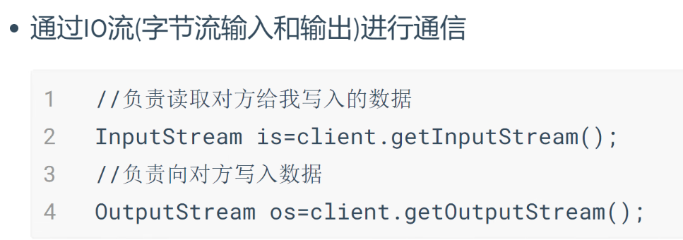
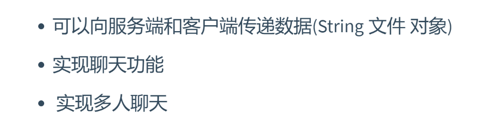

### 1. 网络的好处
> 最根本就是实现了多个计算机之间的相互通信。然后才有数据传递、资源共享……

### 2. 如何实现多个计算机相互通信？
> * 通过发送请求（URL(网址)——同一资源定位符） 
> * 一个完整的URL主要包含：协议://ip地址：端口号/目标资源
>   如: http://192.168.1.222:9999/XXX
> 
> 扩展：如果无法使用ping指令，可能是因为环境变量中的System32没了

### 3. 网络通信协议
> 协议：表示网络传输中大家都要一起遵循的规范，无论是发送数据还是接收数据都有一个同一的标准，这样更便于计算机的通信
> * http协议：底层实现是基于TCP协议，超文本传输协议：可以传输文件、视频、音频、文件内容……
> * https协议：基于http协议的加密版本，在网络传输时底层实现加密算法，防止外部攻击的。
> * ftp协议：用于实现上传文件的服务器，后期传递文件，不是在本地磁盘或数据库存储，而是通过文件服务器，或者云服务器。
> * TCP协议：网络传输协议
> * UDP协议：用户数据报协议

### 4. TCP 和 UDP协议的区别
> 
> 面向字节流传输的优点：因为是传输字节，所以可以传输任何内容，Http就是基于TCP才能实现超文本传输。

### 5. TCP的三次握手 （建立连接）
> 
> * 第一次握手：浏览器向服务器发送一个建立连接的请求。（SYN请求连接数据包）
> * 第二次握手：服务器告诉浏览器，同意连接请求，同时服务器也向浏览器发送建立连接的请求。（ACK确认包 + SYN请求连接数据包）
> * 第三次握手：浏览器也要告诉服务器，同意连接请求。（ACK确认数据包）

### 6. TCP的四次挥手
> 
> 注：`FIN:断开连接数据包， ACK:确认数据包`
> * 第一次挥手：浏览器打算断开连接，向服务器发送一个FIN(断开连接数据包)
> * 第二次挥手：服务器接收到了对方发送的FIN数据包，就向浏览器发送确认（ACK确认数据包）
> * 第三次挥手：服务器也打算断开连接，向浏览器发送一个FIN数据包
> * 第四次挥手：浏览器接收到了对方发送的FIN数据包，向服务器发送ACK确认包

### 7. IP地址
> ip地址目的就是快速找到是哪一台计算机（类似于家庭地址），是由32位二进制数构成，会分成四组，每组8位，由于不好记忆通常会用点分十进制法来表示（192.167.1.100)
> 由于IP地址也不好记忆，一般公司会把自己公司的一组IP地址绑定成一个域名

### 8. 端口号
> 端口号的目的是用来区分同一台计算机上不同的应用程序，所以说每个应用程序一定会有不同的端口号。 
> 端口号取值范围：1—65535(2^32-1)   
> 一般来说：1—1024是系统默认端口号 一定不要使用，否则会出现端口号被占用的错误 
> 常用程序使用的端口号：`http默认端口80` `ftp默认端口21` `mysql默认端口3306`
> `oracle默认端口1521` `redis默认端口6379` `tomcat默认端口8080`

### 9. Socket
> Socket是表示在网络运行过程中可以进行双向通信，基于C/S 基于客户端（Client) 和服务端（Server)双向通信 
> 可以通过客户端向服务端发送数据，反过来也是可以的 
> 通过IP地址 + 端口来访问服务端，这样就可以创建Socket对象进行通信了

### 10. Socket工作原理
> a. 创建服务端对象(端口号：int) 
> b. 创建客户端对象(IP:String, 端口号：int) 
> c. 关闭流。
> 
> 
>  上面的两个client是同一个对象 
> 
>  因为是通过字节流进行通信，所以能传输任何信息
> 
> 更流相关的一般都需要关闭，但服务端要看需不需要给别的对象提供服务，再选择关闭。

### 11. Socket应用场景
