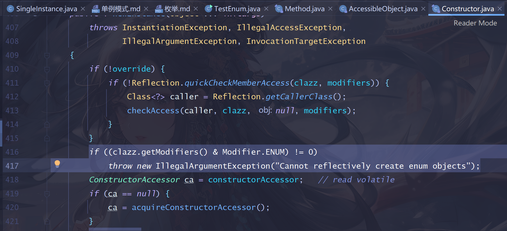
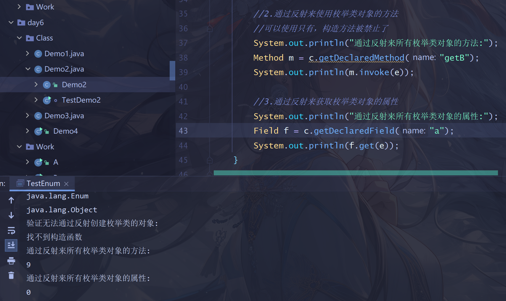

## 枚举
> * 是jdk1.5支持的一个类型，关键字enum 
> * 其实和class基本是一样的，同样可以保存 成员变量，构造方法，静态变量…… 
> * 但是枚举强制要求，`构造方法必须私有`。
> * 枚举还会保存很多常量，`通过常量的个数来控制构造方法的执行次数`。
> *  枚举类的构造方法只能在类中调用，用于创建枚举常量。
> * 枚举类中有几个枚举常量，就会调用几次构造函数。

> 为什么enum无法通过反射创建对象
> 
> 因为在newInstance()中加了一个判断：是ENUM类型就直接抛异常。

> 但我们可以使用反射来获取枚举类对象的属性和方法，不受限制
> 