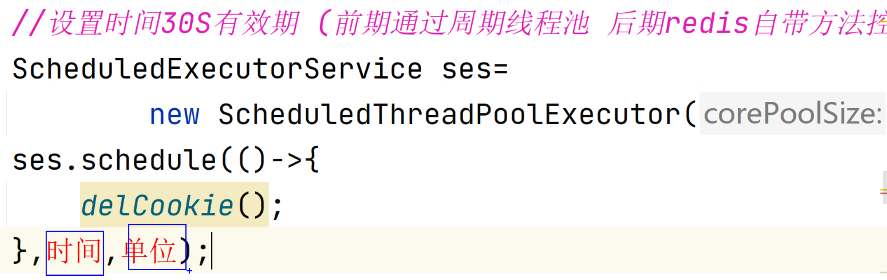
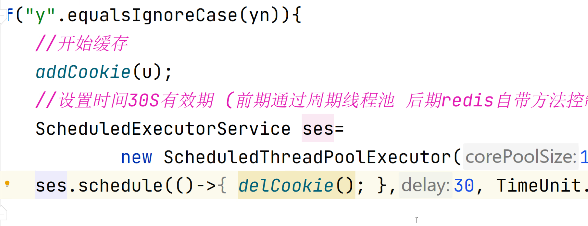
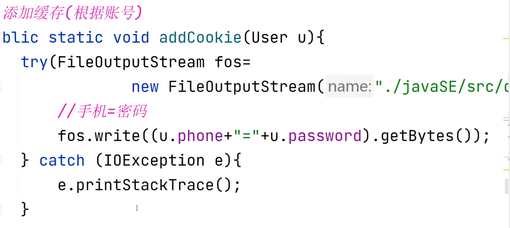
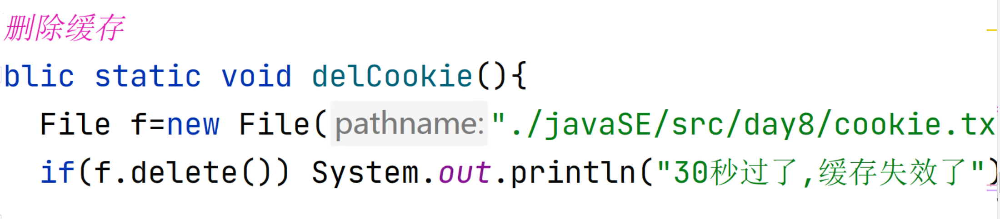
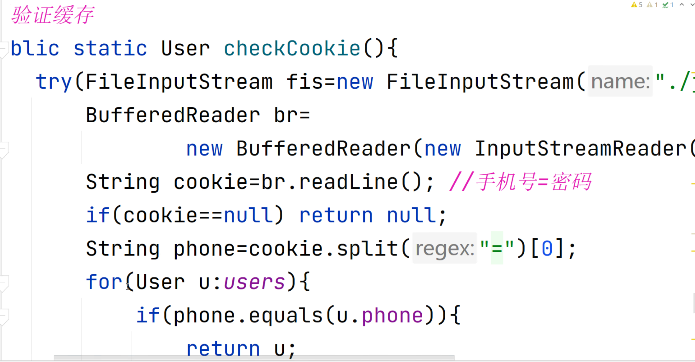
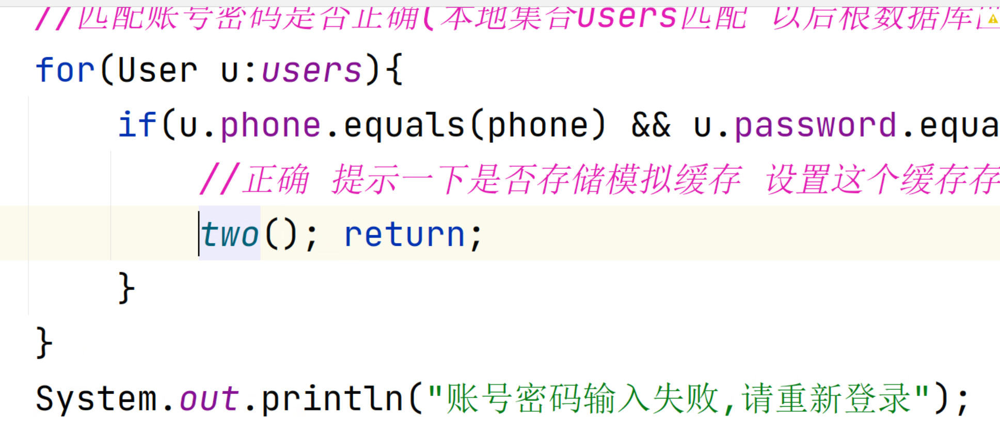

0. 使用软编码来保存常量
> 软编码是指通过变量、配置文件、参数等方式将具体数值或路径抽象出来，而不是直接写入代码。 
> 涉及常量（如文件路径、提示语句等）可以使用硬编码，方便后续修改，提供程序的可维护性。

1. 案例里要多次使用scanner对象时，如何优化？
> 可以把Scanner定义为工具类下的静态常量，让所以类都能使用。

2. 用户选择时如何判断用户是否输入的是数字？
> 可以使用Scanner类的hasNextInt()方法来判断用户输入是否是一个整数

3. 系统的框架
> 死循环 + switch + case分支调用方法（子系统）。
> 退出系统：a.可以在case分支中使用return。b. 将控制分支的变量放在switch外。
> 在要实现一个系统案例时，可以先按照上面的方法搭建出系统的框架。
> 系统中子系统的实现也可以按上面的步骤来走。

4. 退出登录 和 返回上一级菜单的区别
> 退出登录要删除登录信息后再返回上一级。
> 返回上一级菜单是通过return直接返回上一级。

5. 使用List和Map集合保存用户信息
> 使用Map集合的好处，查找用户时效率更高。

6. 用户信息的保存和读取
> 注册成功后要将用户信息保存到本地。（序列化）
> 在进入系统时要读取本地的用户信息（反序列化），`可以利用静态代码块`。
> ==注意静态代码块要写在要初始化的成员的后面，不然创建成员时又会被初始化一次。==

7. 序列化的注意事项：
> a. 要保证涉及的类都支持序列化，即都实现了Serializable。 
> b. 创建对象输出流。（ObjectOutputStream(FileOutputStream(file))）
> c. 关闭流。（try + Closeable接口）
> > 注：只要有close()方法，就一定实现了Closeable接口。
> > 注：Java文件对象的相对路径的"."是以当前项目为起点的。而不是以当前.java文件。

8. 反序列化的注意事项：
> >注意第一次进入系统，还没有本地用户信息怎么办？ -通过文件对象判断文件是否存在 -异常处理
>
> a. 保证实现了Serializable接口
> b. 创建对象输入流。（ObjectInputStream(FileInputStream(file))
> c. 关闭流。（try + Closeable接口)

9. `实现免登录  16:20`
> * 通过 IO流+文件 来实现缓存功能。
> * 用一个保存标识符的文件作为缓存，添加缓存就是创建该文件，删除缓存就是删除该文件，验证缓存就是读取文件来匹配标识符。
> * 文件中保存的就是一个标识符，表示用户已经登录过。（这个标识符必须和用户信息有关不然不知道是哪个用户的缓存。）
> * 把在登录函数中加一个判断只要匹配到该标识符就可以进行免登录。注意步骤封装成验证缓存。
> * 删除缓存就是直接删除缓存文件。
> 添加缓存（根据账号参数来确定添加谁的缓存）

11. 实现定时删除缓存 
> -- 1.通过可周期定长线程池。 -- 2. rides自带方法控制时间。
> 
> 在 第一次成功登录时：提示一下是否存储用户账号密码信息，设置这个缓存的存活时间，然后再进入二级菜单
> 
> 
> 
> 

12. 实现登录
> 
> * 账号密码输入失败就直接退出登录函数，回到一级菜单。或是通过循环加上三次错误验证

13. 实现消息私聊
> a. 确定消息的发送方（当前账户） 和 接收方（goal）
> b. 创建一个服务端（ServerSocket）作为中转站，所有消息都要经过它。
> c. 服务端是一个死循环，永远不会停下。在循环中每连接一个客户端，就创建一个线程来单独负责它的读写操作。
> d. 定义一个Map集合，key表示用户独有信息，value表示对应的客户端对象。

> e. 创建客户端
> 创建客户端线程，用来实现监听服务端发来的消息（写个线程单独来处理）
> 第一次写入要告诉服务端 发送方和接收方
> 然后循环向服务器写入消息，让它转发给接收方