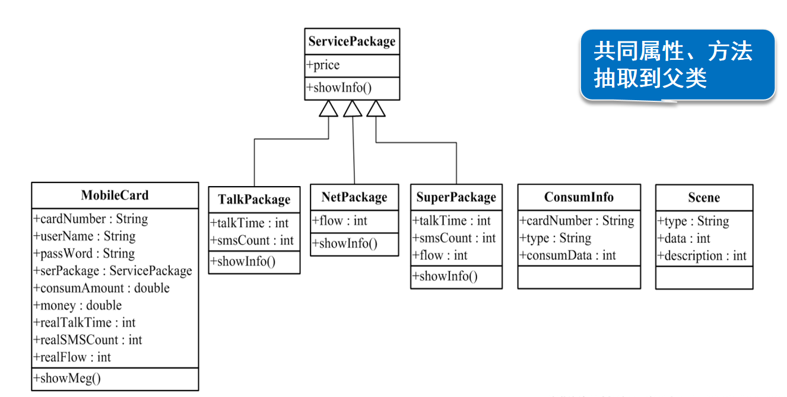

# 项目分析
> 项目优点：对项目进行了分层，而且不同类型的功能做到了尽量解耦。

## 一、项目分层
> 1. EntiryClass : 模型层，存放系统中涉及的实体类。
> 
> 2. BusinerssClass : 业务层。
>  * 主系统
>  * 注册系统
>  * 登录系统
>  * 用户空间系统 
>  * 工具类 (Scanner, Random, 打印，清空缓存)
>  * 信息池（模拟数据库：用户Map, 消费记录Map，场景List， 序列化和反序列化)
> 
> 3. CacheFiles : 存放系统运行过程中生成的缓存文件。
>   * List : 存放用户的消费记录
>   * LoginCache : 实现 免登录 和登录系统和用户空间系统分离
>   * SaveLocal : 方便调试

## 二. 系统框架
> * 一级菜单： 
>   a. 用户注册 
>   b. 用户登录 
>   c. 资费说明：`将"资费说明.txt"的文件中所有套餐的信息打印出来（IO流）`  

> * 二级菜单（用户登录后进入二级菜单）： 
>   a. 话费充值 ：`为指定卡号充值，充值金额至少50元` 
>   b. 使用兜兜5G : `选择后随机一个场景对象进行使用` 
>   c. 本月账单查询  
>   d. 套餐余量查询  
>   e. 打印消费详单  
>   f. 套餐变更：`不同：判断能不能修改套餐，能就扣费、修改套餐和相关数据; 相同：提示无需变更套餐` 
>   g. 联系客服：`Socket编程` 
>   h. 办理退网：`从已注册用户列表中删除; 退出系统` 

## 二. 实体类分析：
1. 电话卡类 MobileCard
> 属性：
> * cardNumber : String （卡号：和手机号对应）
> * userName : String  
> * passWord : String
> * serPackage : ServicePackage （套餐类型：和套餐类对应）
> * consumAmount : double （已消费金额）
> * money : double  （余额）
> * realTalkTime : int  （剩余通话时间）
> * realSMSCount : int   （剩余短信数量）
> * realFlow : int  （剩余流量）
> 

> 
>方法：
> * showMeg() : String (显示当前电话卡对象的信息）

2. 通话套餐类 TalkPackage
> 字段：
> * talkTime : int （通话时间：当前套餐的通话时间）
> * smsCount : int （短信数量：当前套餐的短信数量）
> * price : double （当前套餐的价格）
> 

> 方法：
>
> * showInfo() : String (显示当套餐的信息）

3. 流量套餐类 NetPackage
> 字段：
> * flow : int （流量：当前套餐的流量）
> * price : double （当前套餐的价格）
> 

> 方法：
>
> * showInfo() : String (显示当前电话卡对象的信息）

4. 综合套餐类 SuperPackage
> 字段：
> * talkTime : int （通话时间：当前套餐的通话时间）
> * smsCount : int （短信数量：当前套餐的短信数量）
> * flow : int （流量：当前套餐的流量）
> * price : double （当前套餐的价格）
> 

> 方法：
>
> * showInfo() : String (显示当前套餐的信息）

5. 消费记录类 ConsumInfo（记录使用场景后的使用情况）
> 字段：
> * talkTime : int （通话时间：当前套餐的通话时间）
> * smsCount : int （短信数量：当前套餐的短信数量）
> * flow : int （流量：当前套餐的流量）
> * price : double （当前套餐的价格）
> 

> 方法：
>
> * 无

6. 模拟使用场景类 Scene（用来让用户模拟使用电话卡）
> * type : String （ 被使用的元素（通话时间、短信数量、流量））
> * data : int （使用的数量）
> * description : String (对使用场景的描述) 
> * price : double （如果对应元素消耗完时，本次使用需要的花费）
> 

> 方法：
>
> * 无

三、优化实体类
> 经观察，三个套餐类存在重复字段，所以可以提取出来形成一个父类。
1. 套餐类 （ 通话套餐类、流量套餐类、综合套餐类的父类）
> 字段：
> * price : double （当前套餐的价格）
> 

> 方法：
>
> * showInfo() : String (显示当前套餐的信息）

## 如何减少系统不同功能模块之间的耦合？
> 1. 主系统的功能，就是负责调用子模块提供的方法。
> 2. 